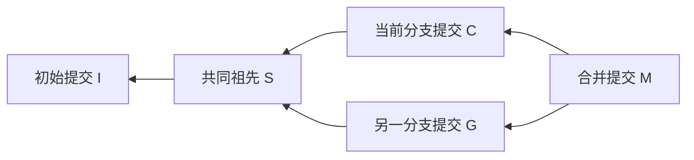

# Gitlet：Python 中文项目说明

本说明以当前 Python 程序为对象，介绍如何完成和使用一个小型本地版本控制系统。
课程背景和行为依据见 [CS61B Spring 2021 Gitlet 原说明](https://sp21.datastructur.es/materials/proj/proj2/proj2)。
本文是独立编写的中文适配文档，包含 Python 操作示例与实现约定，不是原网页逐段翻译。

## 1. 学习目标与范围

你要实现的程序名为 Gitlet。它为文件集合保存历史版本，可以恢复文件、维护不同开发分支，
并把两个分支的变化合到一起。一个提交引用根 tree，根 tree 及其子 tree 表示完整的文件快照。

本项目包含 12 个本地命令：`init`、`add`、`commit`、`log`、`global-log`、
`find`、`status`、`checkout`、`branch`、`rm-branch`、`reset`、`merge`。
`checkout` 有三种参数形式。`status` 显示分支、已暂存变化、未暂存变化和未跟踪文件四个栏目。
`add-remote`、`rm-remote`、`push`、`fetch`、`pull` 是后续扩展，本实现没有包含它们。

使用 Python 3.10+ 和标准库即可。仓库支持子目录中的普通文件。
文件参数使用相对仓库根目录的路径，例如 `note.txt` 或 `src/note.txt`，不能使用绝对路径或 `../note.txt`。
`add` 接受单个文件、目录或 `.`，统一暂存新增、修改和删除；不再提供 `gitlet rm`。
当前仓库格式为 v3，暂存区为 Stage，保存在 `stage.json`；旧格式需另行迁移。
不追踪符号链接、权限和空目录，不提供真实 Git 的网络协议或 detached HEAD 模式。

## 2. 启动与运行约定

在项目目录中，入口是：

```sh
python3 -m gitlet 命令 参数...
```

在其他目录使用绝对路径入口，既不需要安装，也不会混淆代码目录与工作目录：

```sh
python3 /workspace/pygit/gitlet_cli.py 命令 参数...
```

如果已经执行 `python3 -m pip install -e /workspace/pygit`，也可以直接写 `gitlet 命令 参数...`。
后面的示例使用这个短写法；未安装时替换为绝对路径入口即可。

每条命令都是一个独立进程。程序从工作目录中的 `.gitlet` 读取状态，执行后把变更写回。
程序只识别**当前目录**中的仓库，不向上搜索父目录。多词提交消息需要引号。

| 输入情况 | 标准输出 |
| --- | --- |
| 没有命令 | `Please enter a command.` |
| 命令不存在 | `No command with that name exists.` |
| 参数数量或格式错误 | `Incorrect operands.` |
| 有效的非 `init` 命令，但当前目录未初始化 | `Not in an initialized Gitlet directory.` |

检查顺序为命令名、参数形式、仓库初始化状态，再执行命令。成功的写操作一般不打印文字。
课程规定的命令错误打印到标准输出，保留英文及句末标点，进程退出码为 0。
预期失败不会留下半完成的工作区或元数据修改。磁盘损坏、断电和并发执行不属于此学习实现的事务保证范围。

## 3. 核心概念

| 概念 | 在本实现中的含义 |
| --- | --- |
| 工作目录 working directory | 用户正在编辑的普通文件所在目录 |
| 文件对象 blob | 某个文件版本的原始字节内容；ID 是对象头部与内容的 SHA-1 |
| 暂存区 staging area | 下一次提交准备采用的文件版本及待删除的文件名 |
| 目录对象 tree | 当前目录下的名称、对象类型与 blob / 子 tree ID |
| 提交 commit | 消息、时间、零到两个父提交 ID，以及根 tree ID |
| 分支 branch / HEAD | 分支名对应一个提交 ID；HEAD 保存当前分支的符号引用 |

`add` 保存的是执行当时的文件内容。之后再编辑文件，不会自动更新暂存区。
`commit` 向父提交的 tree 应用暂存变化，复用未变化的目录对象；未暂存的工作目录变化不会进入提交。

例如：

```sh
printf 'version one\n' > note.txt
gitlet add note.txt
printf 'version two\n' > note.txt
gitlet commit "保存已暂存版本"
gitlet checkout -- note.txt
```

最后恢复出来的是 `version one`。第二次修改未经过 `add`。

历史最初像链表；分支发展后形成分叉；合并提交有两个父节点，因此最终是有向无环图。
图中箭头表示“子提交指向父提交”：



已保存的提交和 blob 不会因 `reset` 或删除分支被删除。相同文件内容共享 blob，
不同提交引用各自的根 tree，并可复用未变化的子 tree。提交 ID 是 40 位小写十六进制字符串，不与真实 Git 或 Java 版互通。

## 4. 本地命令

### 4.1 `init`：创建仓库

```sh
gitlet init
```

创建 `.gitlet`、空暂存区和 `master` 分支。初始提交不包含文件，消息为 `initial commit`，
时间戳为 Unix epoch，即 `1970-01-01 00:00:00 UTC`。所有 Python Gitlet 仓库具有相同的初始提交 ID。

如果 `.gitlet` 已存在，输出 `A Gitlet version-control system already exists in the current directory.`。
重复初始化不会清空已有仓库。

### 4.2 `add`：暂存一个文件

```sh
gitlet add note.txt
```

把文件当前字节内容保存成 blob，并更新暂存区。已经暂存过同名文件时，以这次的版本替换。
若内容与当前提交相同，取消这个文件的新增暂存；无论内容是否变化，都取消其待删除标记。
已跟踪文件缺失时暂存删除；仅曾暂存新增的文件缺失时取消新增暂存。
文件缺失且 HEAD、Stage 都没有对应记录时输出 `File does not exist.`。
`gitlet add src` 暂存 src 下的新增、修改和删除，整个目录已被删除时也可使用。
`gitlet add .` 暂存整个仓库的变化，排除根目录 `.gitlet` 元数据。
批量暂存先验证全部计划，不修改工作文件。

### 4.3 `commit`：保存暂存快照

```sh
gitlet commit "完成解析器"
```

新提交采用父提交的所有文件版本，然后添加或替换新增暂存的版本，并移除待删除文件。
父节点是提交前当前分支的头。提交后当前分支指向新提交，暂存区清空；工作文件不被改写。
文件在工作目录中被修改或手动删除，都不会影响已暂存或继承的版本。

空消息或全空白消息输出 `Please enter a commit message.`。
没有任何新增或删除暂存时输出 `No changes added to the commit.`。
没有传递消息参数属于参数错误，输出 `Incorrect operands.`。

### 4.4 `log`：查看当前分支历史

```sh
gitlet log
```

从当前提交开始，沿第一父提交一直打印到初始提交。合并的第二父节点不会加入这条日志链。
每个条目格式如下，ID 和日期会随实际提交变化：

```text
===
commit <40位提交ID>
Date: Fri Oct 2 10:15:30 2026 +0000
完成解析器

```

合并提交在 `commit` 行与 `Date` 行之间额外输出 `Merge: <第一父ID前7位> <第二父ID前7位>`。
日期用本地时区显示，星期和月份固定为英文；每个条目后有一个空行。

### 4.5 `global-log`：查看所有提交

```sh
gitlet global-log
```

输出仓库保存的每一个提交，包括已被 `reset` 跳过、或者不再有分支指向的提交。
条目格式与 `log` 相同。输出顺序不限，程序遍历统一对象库并筛选 commit，不保证时间或 ID 排序。

### 4.6 `find`：按提交消息查找

```sh
gitlet find "完成解析器"
```

对完整消息进行精确比较，输出所有匹配的提交 ID，每行一个。
没有匹配时输出 `Found no commit with that message.`。该操作不是模糊搜索。

### 4.7 `status`：查看仓库与文件状态

```sh
gitlet status
```

依次输出下列栏目，栏目之间及最后保留空行，条目按名称排序：

```text
=== Branches ===
*master
topic

=== Changes Staged For Commit ===
new.txt (new)
old.txt (deleted)

=== Modifications Not Staged For Commit ===
note.txt (modified)

=== Untracked Files ===
scratch.txt

```

星号标记当前分支，排序时不计星号。
“未暂存修改”包括：已跟踪文件被改动但未暂存、文件内容与新增暂存的版本不同、
新增暂存后文件被删除，以及已跟踪文件被手动删除但未暂存删除。
同一缺失文件只输出一条 `(deleted)`。

“未跟踪文件”包括：既未被当前提交跟踪、也未新增暂存的普通文件；
还包括删除后通过 `add` 暂存、后来又手动创建的同名文件。子目录中的文件以相对路径列出。
本程序实现了这两个扩展栏目，而非只输出标题。

### 4.8 `checkout`：恢复文件或切换分支

三种调用形式：

```sh
gitlet checkout -- note.txt
gitlet checkout 提交ID -- note.txt
gitlet checkout topic
```

前两种从当前提交或指定提交恢复单个文件，可以覆盖工作目录中的普通文件。
它们不移动 HEAD 或分支指针，也不改变暂存区。
提交中不存在文件时输出 `File does not exist in that commit.`。
提交 ID 不存在时输出 `No commit with that id exists.`。

第三种将目标分支设为当前分支，恢复它跟踪的所有文件；
当前提交跟踪、目标提交不跟踪的文件从工作目录删除；暂存区清空。
其他未跟踪文件保留。

| 分支切换失败条件 | 输出 |
| --- | --- |
| 目标分支不存在 | `No such branch exists.` |
| 已经处于目标分支 | `No need to checkout the current branch.` |
| 将覆盖当前提交未跟踪的工作文件 | `There is an untracked file in the way; delete it, or add and commit it first.` |

覆盖检查在任何改写之前完成。当前提交没有跟踪的同名工作文件，即使内容相同，
或已经 `add` 但还没有 `commit`，仍会阻止分支切换。

`checkout 提交ID -- 文件名` 和 `reset` 都支持唯一的提交 ID 前缀。
前缀匹配零个或多个提交时，本实现均输出 `No commit with that id exists.`；
原说明未规定歧义前缀的具体报错，这里选择拒绝歧义。

### 4.9 `branch`：创建分支指针

```sh
gitlet branch topic
```

新分支指向当前提交，但不会切换分支，也不复制文件或创建新提交。
同名分支已存在时输出 `A branch with that name already exists.`。

只有之后切换并提交，两个分支的历史才会真正分开。例如：

```sh
gitlet branch topic
gitlet checkout topic
printf 'topic\n' > note.txt
gitlet add note.txt
gitlet commit "主题分支修改"
gitlet checkout master
```

切回 `master` 后会恢复其提交里的版本。
本实现允许 `feature/parser` 这样的分支名，它只是一个名称，不表示跟踪子目录。

### 4.10 `rm-branch`：删除分支指针

```sh
gitlet rm-branch topic
```

删除名称到提交的引用，保留全部历史对象和工作文件。
目标不存在时输出 `A branch with that name does not exist.`；
目标为当前分支时输出 `Cannot remove the current branch.`。

### 4.11 `reset`：恢复指定快照并移动当前分支

```sh
gitlet reset 提交ID
```

恢复目标提交的全部文件，删除当前提交跟踪但目标提交缺少的文件，清空暂存区，
然后将**当前分支**指向目标提交。当前分支名称保持不变，其他分支指针保持原值。

不存在的 ID 使用 `No commit with that id exists.`；
存在未跟踪文件覆盖风险时，使用 `checkout` 的未跟踪文件错误。
这种情况下没有任何文件或指针变更。重置不会删除被跳过的历史提交。

### 4.12 `merge`：合并另一分支

```sh
gitlet merge topic
```

合并使用三份**提交快照**：共同祖先、当前分支头和目标分支头。
不以工作文件的未暂存内容作为版本比较依据。

开始之前检查：暂存区必须没有新增或删除；目标分支必须存在；目标不能是当前分支。
对应输出分别为 `You have uncommitted changes.`、`A branch with that name does not exist.`、
`Cannot merge a branch with itself.`。

共同祖先必须沿两个父节点查找。“最近共同祖先”指不再是其他共同祖先的祖先的节点。
遇到多个候选时，程序优先选择距当前分支较近的，再按距目标分支的距离和 ID 选择。

有两个提前结束的情况：

- 目标分支已经是当前分支的祖先：状态不变，输出 `Given branch is an ancestor of the current branch.`。
- 当前分支是目标分支的祖先：按本课程 SP21 文字定义，执行目标分支的 `checkout`，
  然后输出 `Current branch fast-forwarded.`。因此**当前分支名切换为目标分支**，原分支指针保留。
  这里采用课程对“快进”的定义，它与日常 Git 移动当前分支指针的方式有差别。

其他情况下，逐个文件处理。下面的“未变化”都是相对于共同祖先比较，缺失也算一种状态：

| 快照情况 | 合并结果 |
| --- | --- |
| 目标有变化，当前无变化 | 采用目标版本；目标删除则删除该文件 |
| 当前有变化，目标无变化 | 保留当前版本 |
| 两边最终版本相同，包括都删除 | 保留当前状态 |
| 祖先没有文件，仅当前新增 | 保留当前文件 |
| 祖先没有文件，仅目标新增 | 采用目标文件 |
| 两边变化不同，包括一边修改另一边删除 | 生成冲突文件 |

冲突文件用两边提交中的原始内容拼接，缺失的一侧视为空字节串：

```text
<<<<<<< HEAD
当前分支的内容
=======
目标分支的内容
>>>>>>>
```

标记行自带换行，文件内容按原样拼接；程序不会替内容补换行。
例如两边内容分别是 `left`、`right`，且均没有结尾换行，结果为：

```text
<<<<<<< HEAD
left=======
right>>>>>>>
```

程序先计算所有改写和删除，再检查未跟踪文件覆盖风险，检查通过后才写入工作文件。
发生冲突时也自动提交，消息为 `Merged topic into master.` 这样的固定格式。
第一父节点为合并前的当前分支头，第二父节点为目标分支头；目标分支指针保持原值。
只要任意一个文件冲突，最后输出一次 `Encountered a merge conflict.`。

如果两边分叉后的最终快照没有需要应用的变化，输出 `No changes added to the commit.`，
不创建仅记录双亲的空合并提交。这也是本项目采用的课程规则。
冲突不会阻止自动提交；需要解决冲突时，手动修改文件，再 `add` 和 `commit`。

## 5. 完整的分支与合并练习

在一个新的工作目录中执行；以下示例使用已安装的 `gitlet` 入口：

```sh
gitlet init
printf 'base\n' > note.txt
gitlet add note.txt
gitlet commit "基础版本"
gitlet branch topic

printf 'main\n' > main.txt
gitlet add main.txt
gitlet commit "主分支新增文件"

gitlet checkout topic
printf 'topic\n' > topic.txt
gitlet add topic.txt
gitlet commit "主题分支新增文件"

gitlet checkout master
gitlet merge topic
gitlet log
gitlet status
```

合并后当前分支仍为 `master`，跟踪 `note.txt`、`main.txt`、`topic.txt`。
新提交有两个父节点，暂存区为空。这里两个分支分别新增不同文件，所以没有冲突。
要体验冲突，可以让两个分支分别把 `note.txt` 改成不同内容并提交，再合并。

## 6. Java 内容如何对应到 Python

| 原 Java 形式 | 当前 Python 形式 |
| --- | --- |
| `java gitlet.Main ...` | `python3 -m gitlet ...` 或绝对路径脚本 |
| `Main.main(String[] args)` | `cli.main(argv)`，只做检查和分发 |
| `Commit`、`Repository` | `models.Commit`、`repository.Repository` |
| `HashMap<String, String>` | `dict[str, str]` |
| 暂存删除的集合 | `set[str]`，落盘为排序后的 JSON 数组 |
| `java.io.File`、`Utils.join` | `pathlib.Path` 与 `/` 路径拼接 |
| `Utils.readContents`、`writeContents` | `Path.read_bytes()`、`write_bytes()` |
| `Serializable`、`ObjectOutputStream` | 稳定 JSON 元数据及单独的二进制 blob |
| `MessageDigest` | `hashlib.sha1()` |
| `Date`、`SimpleDateFormat` | `time.time_ns()`、`datetime` |
| JUnit / 原 Java 测试入口 | `unittest` 与 `subprocess.run()` |

Python 解释执行，不需要 Java 编译步骤。原课程的 Java 评分环境、2021 年截止日期、
Gradescope 配额和 snaps 提交流程不适用于本地 Python 学习项目。
本项目用 [设计说明](DESIGN.zh-CN.md) 和本地测试代替这些交付环节。

## 7. 测试与调试

```sh
cd /workspace/pygit
python3 -m unittest discover -s tests -v
```

每个测试创建一个临时仓库。多数测试通过新 Python 进程调用入口，
检查输出、工作文件和 `.gitlet` 的内容，因此能发现“上一条命令只更新内存”的错误。

覆盖重点包括暂存后再次修改、修改后恢复原内容、删除并重新创建、
分支切换与重置、未跟踪文件保护、合并冲突的完整字节内容、双亲日志、
合并图中的祖先选择和超过 Python 递归深度的历史。
行为测试不是官方 Java 自动评分结果；无法据此声称已通过官方评分器。

运行单个测试：

```sh
python3 -m unittest discover -s tests -k merge -v
```

该命令选出名称包含 `merge` 的测试。要调试某次命令，可以在独立的工作目录运行：

```sh
python3 -m pdb /workspace/pygit/gitlet_cli.py status
```

HEAD 与暂存区可直接阅读：

```sh
cat .gitlet/HEAD
python3 -m json.tool .gitlet/stage.json
```

对象保存在 `.gitlet/objects/<ID 前两位>/<ID 剩余部分>`，使用 zlib 压缩。
可通过 `Repository.objects.read(完整对象ID)` 查看解析后的对象。

日志顺序不对时检查父提交链接；文件恢复不对时检查 blob ID 和原始字节；
`status` 不对时先检查前面的 `add` 是否正确保存了暂存区。

## 8. 后续远程扩展

原课程把本地目录之间的仓库同步作为选做，不要求实现真实网络服务。
可以在本地部分稳定之后考虑这些接口：

| 预留命令 | 扩展目标 |
| --- | --- |
| `gitlet add-remote 名称 路径/.gitlet` | 保存远程目录别名 |
| `gitlet rm-remote 名称` | 移除别名 |
| `gitlet push 名称 分支` | 在允许快进的情况下复制缺失对象并更新远程分支 |
| `gitlet fetch 名称 分支` | 复制远程对象并更新本地远程跟踪分支 |
| `gitlet pull 名称 分支` | 获取后合并 |

当前程序会把这些未实现命令作为未知命令处理。实现远程扩展前，需要继续明确
远程目录缺失、目标分支缺失、无法快进等错误行为，并添加独立仓库之间的集成测试。
